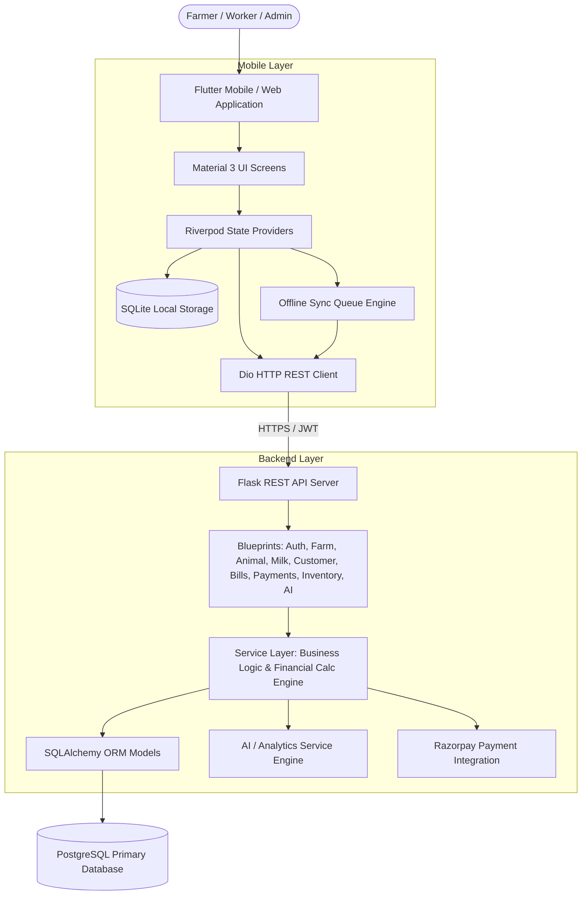

# DairyMitra Architecture

## 1. System Overview

DairyMitra is a production-ready, full-stack, offline-first smart dairy & farm management system designed to digitize dairy farming operations, replace paper registers, and provide actionable business intelligence.

## 2. Core Architectural Principles

1. **Backend as Source of Truth**:
   The backend database is always the authoritative source for calculations (net profit, billing balance, inventory count, verified payment status). Flutter displays verified data.
2. **Offline-First Resilience**:
   Critical daily actions (morning/evening milk entry, customer deliveries, daily expenses) can be captured offline in SQLite, added to a persistent sync queue, and idempotently synced to PostgreSQL once internet is restored.
3. **Layered Clean Architecture**:
   - Presentation Layer: Responsive Material 3 Flutter widgets and controllers.
   - Domain / State Layer: Riverpod state notifiers and providers.
   - Network / Data Layer: Dio client with JWT interceptor, refresh token rotation, and SQLite database.
   - Backend Presentation: Versioned REST API endpoints (`/api/v1/...`).
   - Backend Business Logic: Service layer with audit logging and transactional atomicity.
   - Backend Data Access: SQLAlchemy ORM models with PostgreSQL indexes and constraints.
4. **Security & Financial Integrity**:
   - Dual-token JWT (Access Token + Refresh Token).
   - Rate-limited, hashed 6-digit OTP verification with expiration and attempt lockout.
   - Razorpay server-side signature verification (HMAC SHA-256). Sensitive credentials strictly kept on backend.
