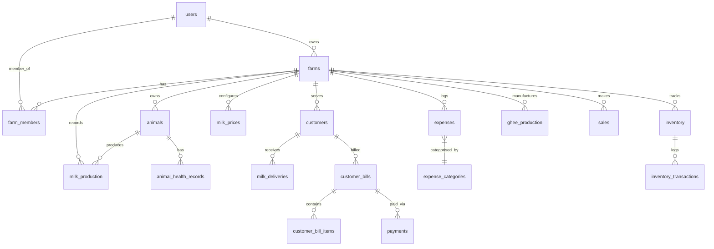

# DairyMitra Database Schema Specification

This document details the PostgreSQL schema designed for high integrity, normalized relations, transactional accuracy, and auditability.

## Schema Entities Summary

1. **users**: id, email, password_hash, full_name, phone, role (FARMER, WORKER, ADMIN), is_active, is_verified, created_at, updated_at.
2. **email_otps**: id, email, otp_hash, purpose (REGISTER, FORGOT_PASSWORD, VERIFY_EMAIL), attempts, max_attempts, expires_at, is_used, created_at.
3. **farms**: id, owner_id, farm_name, address, city, state, pincode, is_active, created_at, updated_at.
4. **farm_members**: id, farm_id, user_id, role (OWNER, MANAGER, WORKER), permissions, created_at.
5. **animals**: id, farm_id, animal_number, name, animal_type (COW, BUFFALO, OTHER), breed, gender, date_of_birth, purchase_date, purchase_price, current_status (ACTIVE, SOLD, DECEASED, INACTIVE), notes, created_at, updated_at.
6. **animal_health_records**: id, animal_id, record_type (VACCINATION, MEDICINE, VET_VISIT, CALVING, CHECKUP), date, description, medicine, cost, next_due_date, notes, created_at.
7. **milk_prices**: id, farm_id, price_per_litre, effective_from, effective_to, is_current, created_at.
8. **milk_production**: id, farm_id, animal_id, date, shift (MORNING, EVENING), quantity, fat_content, notes, recorded_by, created_at, updated_at. (Unique constraint: farm_id, animal_id, date, shift).
9. **customers**: id, farm_id, name, email, phone, address, daily_quantity, price_per_litre, delivery_time (MORNING, EVENING, BOTH), current_balance, status (ACTIVE, INACTIVE), created_at, updated_at.
10. **milk_deliveries**: id, farm_id, customer_id, date, shift, quantity, price_per_litre, total_amount, delivery_status (DELIVERED, SKIPPED, CANCELLED), notes, recorded_by, created_at, updated_at.
11. **customer_bills**: id, farm_id, customer_id, bill_number, start_date, end_date, total_milk_qty, milk_amount, previous_balance, grand_total, paid_amount, balance_due, status (PENDING, PARTIALLY_PAID, PAID, CANCELLED), generated_at.
12. **customer_bill_items**: id, bill_id, delivery_id, date, shift, quantity, rate, amount.
13. **payments**: id, farm_id, customer_id, bill_id, amount, payment_method (CASH, UPI, RAZORPAY, BANK_TRANSFER), gateway_order_id, gateway_payment_id, gateway_signature, status (CREATED, PENDING, SUCCESS, FAILED, REFUNDED), notes, verified_at, created_at.
14. **expense_categories**: id, farm_id, name, code, is_default, created_at.
15. **expenses**: id, farm_id, category_id, amount, date, description, payment_method, receipt_image_url, created_by, created_at, updated_at.
16. **ghee_production**: id, farm_id, date, milk_used_litres, ghee_produced_kg, production_cost, notes, created_at.
17. **inventory**: id, farm_id, item_name, category (FEED, MEDICINE, GHEE, DAIRY_PACKAGING, OTHER), unit (KG, LITRE, PIECE, PACKET), current_stock, minimum_stock_alert, cost_per_unit, updated_at.
18. **inventory_transactions**: id, inventory_id, farm_id, transaction_type (PURCHASE, USAGE, PRODUCTION, SALE, ADJUSTMENT), quantity, unit_price, total_cost, reference_id, reference_type, date, notes, created_at.
19. **sales**: id, farm_id, customer_id, product_type (MILK, GHEE, CATTLE, OTHER), date, total_amount, payment_status, notes, created_at.
20. **notifications**: id, user_id, farm_id, title, message, notification_type, is_read, metadata_json, created_at.
21. **audit_logs**: id, user_id, farm_id, action, entity_type, entity_id, ip_address, metadata_json, created_at.
22. **sync_records**: id, farm_id, client_sync_id, entity_type, entity_id, action (CREATE, UPDATE, DELETE), status (APPLIED, CONFLICT, REJECTED), synced_at.
